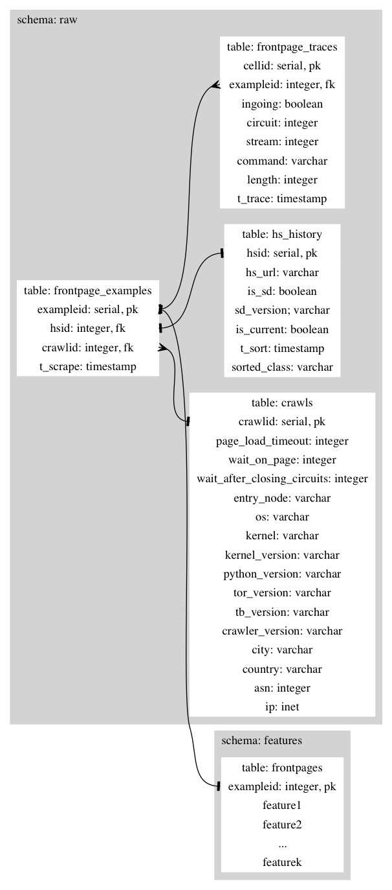

# fingerprint-securedrop

[](https://travis-ci.org/freedomofpress/fingerprint-securedrop)
[](https://coveralls.io/github/freedomofpress/fingerprint-securedrop?branch=travis-and-coveralls)
[](https://gitter.im/freedomofpress/Website_Fingerprinting)
[](http://www.gnu.org/licenses/agpl-3.0)

This repository is a work-in-progress to implement an end-to-end data collection
and analysis pipeline to help tackle the problem of website fingerprinting
attacks in the context of Tor Hidden Services
[[1]](https://www.usenix.org/system/files/conference/usenixsecurity15/sec15-paper-kwon.pdf).
It is designed as a single system that carries out everything from data
collection, to feature generation, to model training and analysis, with the
intention of helping us evaluate and develop defenses to be implement in the
[SecureDrop whistleblower submission
system](https://github.com/freedomofpress/securedrop).

If you are a researcher interested in this problem we encourage you to
collaborate with us in our [Gitter
chatroom](https://gitter.im/freedomofpress/Website_Fingerprinting) and via our
[mailing
list](https://lists.riseup.net/www/arc/tor-traffic-fingerprinting).
Feel free to get in touch
[personally](https://github.com/fowlslegs/fowlslegs-sec-pack) as well.

The pipeline works as follows:
* `sorter.py` scrapes Hidden Service directories, and visits every `.onion` URL
    it finds. It groups sites into two classes: SecureDrop and non-monitored.
* `crawler.py` fetches sites from these classes and records the raw Tor cells.
* `features.py` generates
    [features](https://en.wikipedia.org/wiki/Feature_(machine_learning)) based
    on these raw Tor cells.
* The model training, classification, and presentation of results (graph
    generation) code is still in development.

Our hope is that later we will be able to make this code more composable. There
has already been some effort in that direction, and it should be pretty easy to
use at least the sorter and crawler if you're interested in monitoring a site
besides SecureDrop.

## Getting Started

### Dependencies

* Ansible >= 2.0
* Vagrant
* VirtualBox

### Provisioning a local VM

```
cd fingerprint-securedrop
vagrant up
vagrant ssh
cd /opt/fingerprint-securedrop/fpsd
```

### Running the Sorter

```
./sorter.py
```

To look at the sorter log while it's running run `less +F
logging/sorter-latest.log`. If you're not using the database, data will be
timestamped with `logging/class-data-latest.pickle` being symlinked to the
latest data. Otherwise, run `psql` and poke around the `hs_history` table.

### Running the Crawler

```
./crawler.py
```

To look at the crawler log while it's running run `less +F
logging/crawler-latest.log`, and to look at the raw Tor cell log run `less +F
/var/log/tor_cell_seq.log`. You can also check out the traces it's collecting as
it runs: `cd logging/batch-latest`, or look at the frontpage traces and other
related tables (see the Database Design section).

A systemd unit is also provided to run the crawler on repeat. Simply run
`sudo systemctl start crawler` to start the crawler running
on repeat.

### Using PostgreSQL for data storage and queries

The data collection programs—the sorter and crawler—are integrated with a
PostgreSQL database. When the `use_database` option is set to `True` in the
`[sorter]` section of `fpsd/config.ini`, the sorter will save its sorted onion
addresses in the database. When the `use_database` option is set to `True` in
the `[crawler]` section of `fpsd/config.ini`, the crawler will grab onions from
the database, connect to them, record traces, and store them back in the
database. You can also use a remote database by configure the `[database]` section of
`fpsd/config.ini`.

By default, a strong database password will be generated for you automatically
and will be written to `/tmp/passwordfile` on the Ansible controller, and saved
to a `PGPASSFILE`, `~{{ ansible_user }}/.pgpass` on the remote host (if you want
to set your own password, I recommend setting the `PGPASSWORD` Ansible var
before provisioning--as a precaution re-provisioning will never overwrite a
PGPASSFILE, but you can also do so yourself if you wish to re-configure your
database settings).  Environment variables are also be set such that you should
be able to simply issue the command `psql` to authenticate to the database and
begin an interactive session.

#### Database Design

We store the raw data in the `raw` schema and the derived features in the
`features` schema. The sorter writes to `raw.hs_history`, inserting one row per
sorted onion address. The crawler reads from `raw.hs_history` and writes one row
per crawl session to `raw.crawls`, one row per trace to
`raw.frontpage_examples`, and one row per cell in the trace to
`raw.frontpage_traces`. 

The current design of the database is shown in the following figure:


